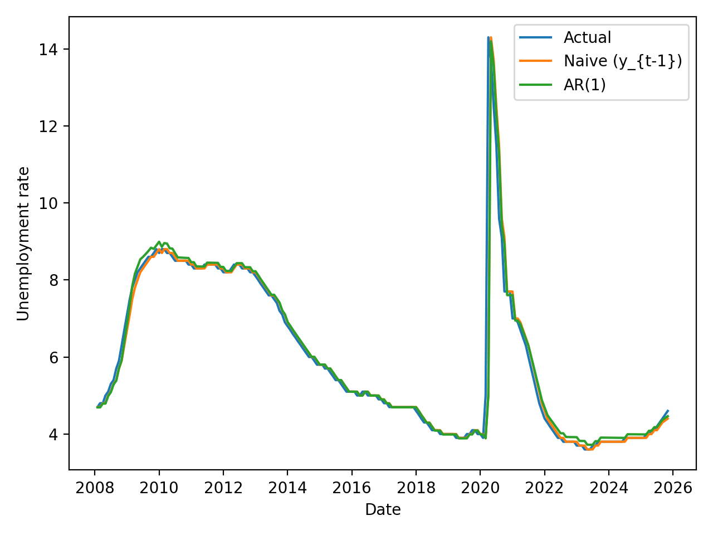

# septa-unemployment-nowcast

## Backtest design (expanding window)
To evaluate whether ridership contains predictive signal without look-ahead bias, models are tested using an expanding-window backtest. For each month t, the model is trained only on data available up through t-1 and then predicts unemployment at t.

### Models compared
- Naive baseline: predict unemployment as last month’s value (y_t = y_{t-1})
- AR(1) regression: y_t ~ y_{t-1}
- ARX regression: y_t ~ y_{t-1} + log(UPT_{t-1})

### Key assumptions
- Monthly alignment: NTD UPT is aggregated to month and merged to monthly FRED unemployment.
- Lag discipline: only lagged ridership is used to predict unemployment (no contemporaneous leakage).
- Aggregation choice: UPT is summed across SEPTA modes to represent total system usage.

### Failure cases / caveats (work in progress)
- Structural breaks: the 2020–2021 period can weaken a stable ridership–unemployment relationship (ridership remained depressed for longer than unemployment).
- Measurement nuance: NTD “adjusted” monthly release may include estimates for delinquent reporting months; this should be treated as a potential source of noise in the most recent period.
- Model selection is ongoing: next steps include trying rate-of-change features (YoY UPT) and robustness checks across pre/post-2020 samples.

### Pre/Post-2020 split (structural break check)
I split the expanding-window backtest at 2020-03 to test for a structural break around COVID.

| Era | Model | MAE | RMSE |
|---|---|---:|---:|
| pre_2020_03 | naive (y_t = y_{t-1}) | 0.0688 | 0.1077 |
| pre_2020_03 | AR(1) regression (y_t ~ y_{t-1}) | 0.0834 | 0.1115 |
| pre_2020_03 | ARX (level) (y_t ~ y_{t-1} + log(UPT_{t-1})) | 0.0854 | 0.1225 |
| post_2020_03 | naive (y_t = y_{t-1}) | 0.3250 | 1.1985 |
| post_2020_03 | AR(1) regression (y_t ~ y_{t-1}) | 0.3602 | 1.1881 |
| post_2020_03 | ARX (level) (y_t ~ y_{t-1} + log(UPT_{t-1})) | 0.3762 | 1.2796 |

Takeaway: performance deteriorates sharply post-2020 and adding ridership *levels* does not improve error in this split, consistent with a structural break (ridership remained depressed long after unemployment normalized).

Pre/post metrics saved in `results/backtest_metrics_by_era.csv`.

