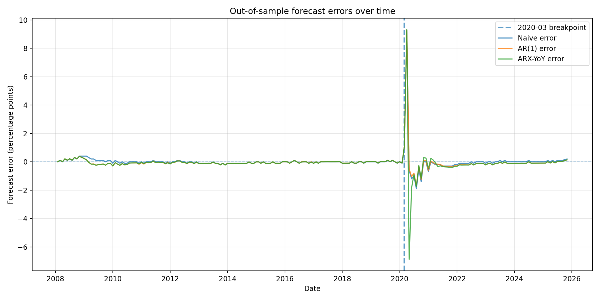

# SEPTA Ridership & Philadelphia Unemployment Nowcasting

**Key finding:** Transit ridership adds no incremental predictive power beyond a simple persistence baseline, and the relationship weakens sharply after a structural break around **2020-03**.

---

## Reproduce (end-to-end)

pip install -r requirements.txt
python3 src/download_fred.py
python3 src/build_panel.py
python3 src/backtest.py
python3 src/make_figure.py

Generated artifacts (not tracked): data/raw/, data/processed/, results/backtest_predictions.csv
Tracked outputs: results/backtest_metrics.csv, results/backtest_metrics_by_era.csv, figures in reports/figures/

---

## Visual diagnostics

Forecast errors spike after 2020-03 across models, consistent with a structural break in the ridership–unemployment relationship.

---

## Results

Monthly unemployment is highly persistent, so a persistence baseline is a strong benchmark.

### Pre/Post-2020 split (structural break check)
I split the expanding-window backtest at 2020-03 to test for a structural break around COVID.

Era | Model | MAE | RMSE
pre_2020_03 | naive (y_t = y_{t-1}) | 0.0688 | 0.1077
pre_2020_03 | AR(1) regression (y_t ~ y_{t-1}) | 0.0834 | 0.1115
pre_2020_03 | ARX (level) (y_t ~ y_{t-1} + log(UPT_{t-1})) | 0.0854 | 0.1225
post_2020_03 | naive (y_t = y_{t-1}) | 0.3250 | 1.1985
post_2020_03 | AR(1) regression (y_t ~ y_{t-1}) | 0.3602 | 1.1881
post_2020_03 | ARX (level) (y_t ~ y_{t-1} + log(UPT_{t-1})) | 0.3762 | 1.2796

Takeaway: performance deteriorates sharply post-2020 and adding ridership levels does not improve error in this split, consistent with a structural break (ridership remained depressed long after unemployment normalized).

Pre/post metrics: results/backtest_metrics_by_era.csv.

---

## Method (what I did)

### Backtest design (expanding window)
To evaluate predictive signal without look-ahead bias, models are tested using an expanding-window backtest. For each month t, the model is trained only on data available through t-1 and then predicts unemployment at t.

### Models compared
- Naive baseline: predict unemployment as last month’s value (y_t = y_{t-1})
- AR(1) regression: y_t ~ y_{t-1}
- ARX regression (level): y_t ~ y_{t-1} + log(UPT_{t-1})

### Key assumptions
- Monthly alignment: NTD UPT is aggregated to month and merged to monthly FRED unemployment.
- Lag discipline: only lagged ridership is used to predict unemployment (no contemporaneous leakage).
- Aggregation choice: UPT is summed across SEPTA modes to represent total system usage.

---

## Caveats / failure cases (documented)
- Structural breaks: the 2020–2021 period can weaken a stable ridership–unemployment relationship (ridership remained depressed longer than unemployment).
- Measurement nuance: the NTD adjusted monthly release may include estimates for delinquent reporting months; treat as a potential source of noise in recent periods.
- Model selection: results reported here are for simple linear specifications; more regime-aware approaches (e.g., rolling windows, explicit break controls) may be needed post-2020.

---

## Implications
- Workforce development / labor monitoring: Post-2020 transit ridership is not a reliable early signal for unemployment; alternative nowcasting signals (e.g., UI claims, job postings) may be more informative.
- Transit planning: The decoupling of ridership from employment suggests structural demand shifts (e.g., remote work). Planning models should not assume pre-pandemic ridership–employment elasticities.
- Forecasters: Large post-2020 error increases illustrate why regime changes matter; applied forecasting should consider rolling retraining windows or explicit structural-break controls.

---

## Data sources
- FRED: Philadelphia-Camden-Wilmington, PA-NJ-DE-MD Unemployment Rate (series: PHIL942UR)
- FTA NTD: Monthly Module Adjusted Data Release (Complete Monthly Ridership with adjustments/estimates)
